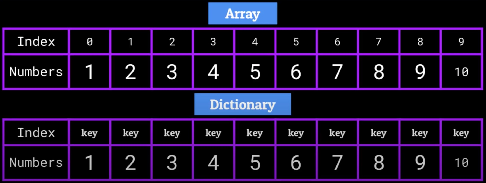

# The Dictionary

Dictionaries may be also called as ”Maps” and ”Associative Arrays”

Dictionary is an abstract Data Structure which stores data in the form of key/value pairs, i.e. the key are used as indexes instead of a numerical index. Those keys and values can be pretty much any primitive data type.

There are two extremely important restrictions when it comes to dictionaries

- Every key can only appear once within the dictionary
- Each key can only have one value

There can be duplicate of values within a dictionary

Dictionaries are built upon Hash Tables, and the keys in our key/value pairs are stores in memory on these hash tables at indexes which are determined by a hash function

## Time complexity of the LinkedList

To access, search for, insert, or delete a key/value pair from our dictionary, all we need to is is run that key throughout hash function and it’ll tell us what index in the hash table to go to in order to perform that operation. Thus, all operation will be of time complexity O(1).

### Accessing -> O(1)

### Searching -> O(1)

### Inserting -> O(1)

### Deleting -> O(1)
