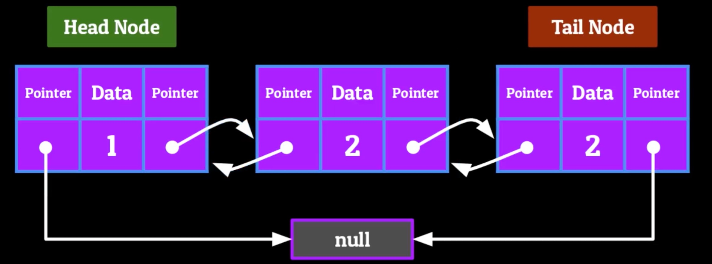

# The Doubly-LinkedList

The Doubly-Linked List is a sequential access data structure which stores data in the form of Nodes

- Able to traverse both forwards and backwards using pointers

## Terminology

- **Next**, that particular Nodes pointer which points to the next object in the List
- **Previous**, that particular pointer which points to the previous object in the List

## Example of Doubly-Linked List



## Adding and Removing Information

### Adding to the Head of a LinkedList

1. Set the new Nodes next to point towards the current head of the List
2. Take the new Node that we want to insert, and set it previous to null
3. Set the current head’s previous to point towards this new Node

### Removing from Head of a LinkedList

1. Set the head Node’s next to point towards a null value
2. Set the second Node’s previous to also point towards a null value

### Inserting into the Middle of a LinkedList

1. Set the new Node’s previous to point towards the Node previous to the position you want to insert at
2. Set the new Node’s next to point towards the Node after position you want to insert at
3. Set the next and previous on the Node’s before and after the one you’re inserting to point towards the new Node

### Removing a Node from the middle of a LinkedList

1. Set the Node before to one we want to remove’s next to point towards the Node after the one we want to remove
2. Set the Node after the one we want remove’s previous to point towards the Node before the one we want to remove
3. Set both pointers of the Node we want to remove to point towards a null value  

### Adding to the Tail of a LinkedList

1. Set the next pointer of the current tail to point towards the new Node we want to become the tail
2. Set the previous of the new Node that we’re adding to be pointing towards the current tail of the List
3. Make the new Node’s next point towards a Null value

### Removing from the Tail of a LinkedList

1. Set the tail Node’s previous to point towards null
2. Set the second to last Node’s next to also point towards null

## Time complexity of the LinkedList

### Accessing -> O(n)

- The accessing will be sequential from head to tail. Thus, the accessing will be of complexity O(n).

### Searching -> O(n)

- Same as accessing

### Inserting -> O(n) or O(1)

- If inserted at the head or tail, O(1).
- If inserted between head and tail the time complexity will be O(n). Since the locations must be located and then inserted.

### Deleting -> O(n) or O(1)

- Same as inserting

## The use cases of Doubly-Linked List

- The back and forth functionality of a Doubly-Linked List lends itself to be implemented in a lot of Stack-like functionality  
