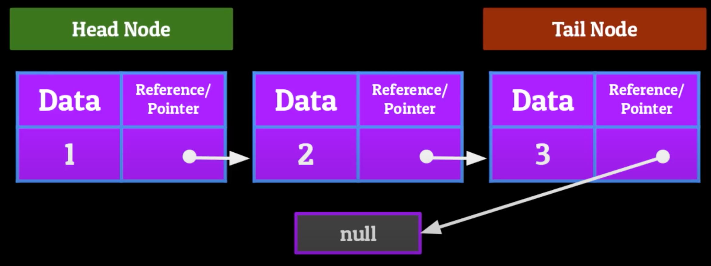

# The LinkedList

A LinkedList is a sequential access linear data structure in which every element is a separate object called a Node, which has 2 parts

- The data
- The reference (or pointer) which points to the next Node in the List.

## Example of LinkedList

The Head Node points towards next Node. The last Node, does not contain any pointer since it is last one in the list, hence the null.



## Adding and Removing Information

Although the LinkedList is sequential, the data can flow in and out any point of a LinkedList.

### Adding to the Head of a LinkedList

- Make that new Node’s pointer point to the current Head of the LinkedList

### Removing from Head of a LinkedList

- Set the Head Node’s pointer to a null value

### Adding a Node to the Middle of a LinkedList

1. Make the pointer of the new Node point to the Node after the location we want to insert at
2. Set the node before the location we want to insert at to point towards the new Node

### Removing a Node from the middle of a LinkedList

- Make the pointer of the Node previous to the one we’re removing, to now point to the Node after the one we’re removing

### Adding to the Tail of a LinkedList

- Make the current tail point towards the new Node you want to add

#### Removing from the Tail of a LinkedList

- Set the previous tail to point towards a null value instead of the current tail

## Time complexity of the LinkedList

### Accessing -> O(n)

- The accessing will be sequential from head to tail. Thus, the accessing will be of complexity O(n).

### Searching -> O(n)

- Same as accessing

### Inserting -> O(n) or O(1)

- If inserted at the head or tail, O(1).
- If inserted between head and tail the time complexity will be O(n). Since the locations must be located and then inserted.

### Deleting -> O(n) or O(1)

- Same as inserting

The use cases for LinkedLists

- LinkedLists can be used in the backing of other data structures. One can use LinkedLists to make Stacks, Queues, etc.
- E.g. Spotifys playlists. Each node contains the song and points towards next song

One Big Drawback
The data can be only tracked forward. There are no pointers in reverse direction. This is resolved by implementing doubly-LinkedList
