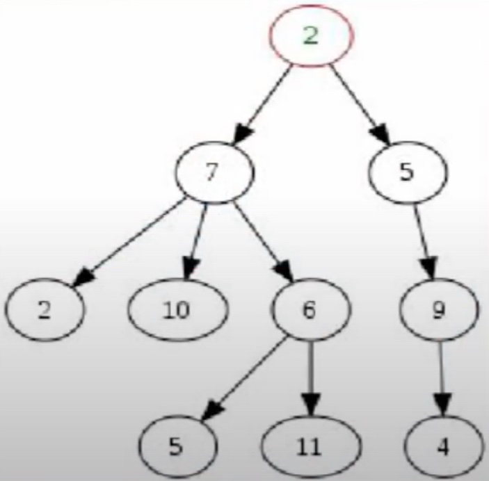

# Trees

A Tree is an abstract Data Structure which contains a series of linked nodes connected together to form a hierarchical representation of information

Like a LinkedList where each Node has the option of pointing towards multiple Nodes

## Example

## Terminology

### A Tree consist of

- **Vertice**, i.e. a certain Node in a Tree
- **Edge**, i.e. a connection between Nodes

### A Tree may contain following nodes

- **Root Node**, topmost Node of a Tree
- **Child Node**, a certain Node which has an edge connecting it to another Node one level above itself
- **Parent Node**, any Node which has 1 or more child Nodes
- **Leaf Node**, a Node in a tree which does not have any child Nodes

### Property of the Tree

- **Height**, number of edges on the longest possible path down towards a leaf

### Property of a Node

- **Depth**, number of edges required to get from that particular node to the root Node

## Different types of Trees

Regular tree are great for storing hierarchical data, but their power can really be heightened when you start messing around with how the data is actually stored within them

- [Binary search tree](./trees/binary-search-tree.md)
- [Tries](./trees/tries.md)
- [Heap](./trees/heap.md)
- [Graph](./trees/graph.md)
