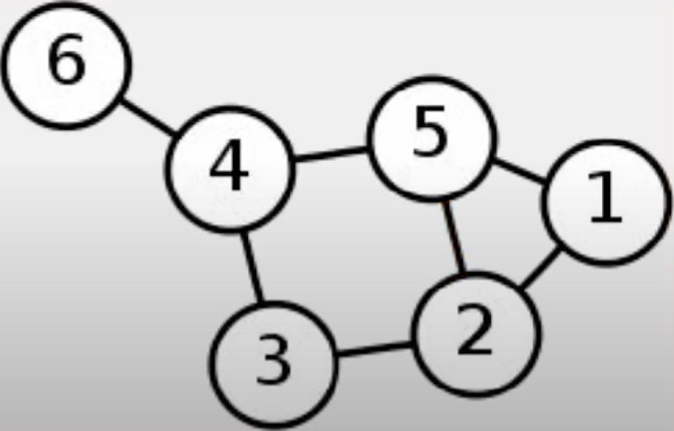

# Graphs

A Graph is a nonlinear Data Structure consisting of Nodes and Edges

- Finite set of Nodes (Vertices)
- Nodes are connected by the edges

On contrary to the Tree-like structure, a Graph has no Root Node. There are multiple starting points

## Representation of a Graph visually

## Representation of a Graph notationally

| Nodes | {1, 2, 3, 4, 5, 6} |
| :-- | :--
| Edges | {(6,4), (4, 5), (4, 3), (3, 2), (5, 2), (2, 1), (5, 1)} |

## Terminology

- **Adjacent Nodes**, two nodes that are the nodes with an edge between them

## Properties and types of Graphs

### Directed vs. Undirected Graphs

An Undirected Graph is a Graph in which the direction you traverse the Nodes is not important

- Usually indicated by a lock of arrows

An Directed Graph is a Graph in which the direction you traverse the Nodes is important

- Usually indicated by a arrow representing direction

### Cyclic vs. Acyclic Graphs

A Cyclic Graph is one which contains a path from at least one Node back to itself

- All Undirected Graphs are Cyclical

An Acyclic Graphs is one which contains no path from any one Node which leads back in on itself

- All directed Graphs are Acyclic

### Weighted vs Unweighted Edges

Weighted Edges:

- Associating a numerical value with each edge (Cost)
- Each weight represents some property of the information you are trying to convey

## Use cases and the types of Graphs

Undirected Cyclical Heaps with Weighted Edges can be used through Dijkstra’s shortest path algorithm

- Compiles a list of the shortest possible paths from that source vertex to all other Nodes within the Graph

Used for:

- Google Maps

Unweighted Cyclical Graphs (Undirected and Directed) are used in the follower system of a majority of social media websites (Facebook, Snapchat, Instagram, Twitter, etc.)
